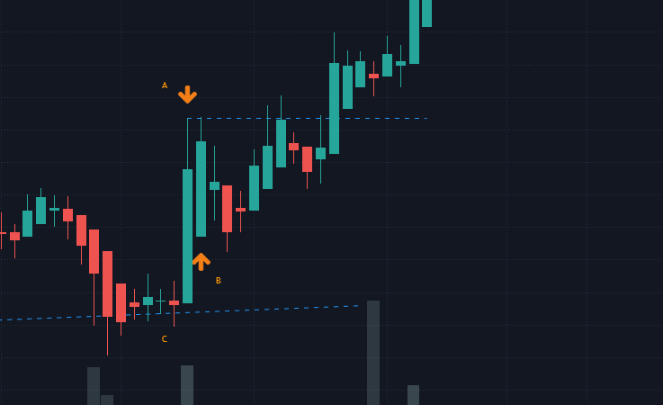
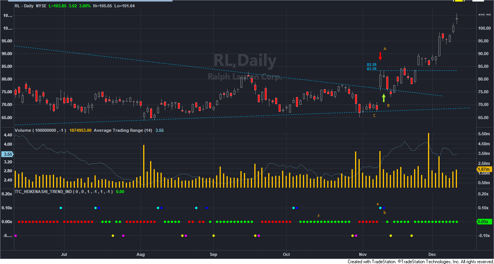
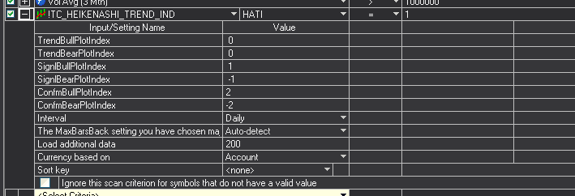

# Heiken-Ashi Trend Indicator

## The Idea

The idea outlined by this indicator is to signal [possibe] trend starting signal for the Heiken-Ashi charting style.

- The __Signal__ (Figure.01 - A) is the first "flat" Heiken-Ashi bar that follows any non-flat bar in the same direction (Figure.01 - C). *The preceeding bar to a Signal bar can be of any color any formation. Except that of a Signal bar itself. Note, this includes a signal bar in the other direction.*

- The __Confirmation__ (Figure.01 - B) to this signal would be the break of the High (if Bullish) of the Signal bar. 

Once confirmed, one can consider a start of a trend.

<small>Figure.01 - Shows the basic concept of the pattern.</small>

---

### Tradestation

The indicator for Tradestation was built to filter out the __Signals__ and allow the trader to assess the conditions of the market, in respects to the signal, and identify possible trends.

<small>Figure.02 - Shows Figure.01 in the context of a Tradestation chart with the Heiken-Ashi Trend Indicator plot. A/a and B/b correspend to the Signal and Confirmation. F is a view of the Heiken-Ashi Trend in that current moment.</small>

The indicator on the chart depicts Signals and Confirmations as a `1` and `-1` value with a Cyan/Blue (Bullish) and a Yellow/Magenta (Bearish) coloring respectively. The trend is plotted on the `0` line and colored Red or Green based on the direction of the Trend. Green for a Bull trend and Red for a Bear trend.

*It should be noted that Tradestation does not have Heiken-Ashi chart rendering options. Which was one of the primary reason behind this tool.*

All indications, Signals, Confirmations, Trend can be provided with specific identifying numbers to allow you to specify exact formations within Tradestation's screening tool.

<small>Figure.03 - Shows a screen configured to find only Bullish Signals.</small>

#### Install

To install, copy the code into Tradestation's EasyLanguage editor and create a new indicator with the given code. Once verified you can begin plotting or adding it to your screeners or RadarScreen.

---

##### Disclaimer

<small>
The Content and code is for informational purposes only, you should not construe any such information or other material as legal, tax, investment, financial, or other advice. Nothing contained within this document or code constitutes a solicitation, recommendation, endorsement, or offer by nowk or any third party service provider to buy or sell any securities or other financial instruments in this or in in any other jurisdiction in which such solicitation or offer would be unlawful under the securities laws of such jurisdiction.
</small>
 
 
<small>
nowk assumes no liability for any damages, direct or otherwise, resulting from the use of this information and/or program(s) described, and no warranty is made regarding its accuracy or completeness. Use of this Web site including the information, tutorials and/or programs included on it is at your own risk. You shall indemnify and hold nowk harmless from any and all liability, loss, trading losses, costs, damage, or expense, including attorneys' fees you or third party may suffer (other than damage to your tangible property or injuries to employees occurring during the course of work) as a result of claims, demands, costs, or judgments arising out of third party and any other claims based on nowk's performance, including, but not limited to losses resulting from the use of nowk developed software, programs, web sites, tutorials, or the TradeStation charting and/or trading platform.
</small>
 
 
<small>
TradeStation&reg;, EasyLanguage&reg; and PowerEditor&reg; are registered trademarks of TradeStation Technologies, Inc. Other brand and product names which appear in this document or code are the trademarks or service marks of their respective owners. Neither TradeStation Technologies nor any of its affiliates has reviewed, certified, endorsed, approved, disapproved or recommended, and neither does or will review, certify, endorse, approve, disapprove or recommend, any product or service that offers training, education or consulting regarding the use of EasyLanguage.
</small>